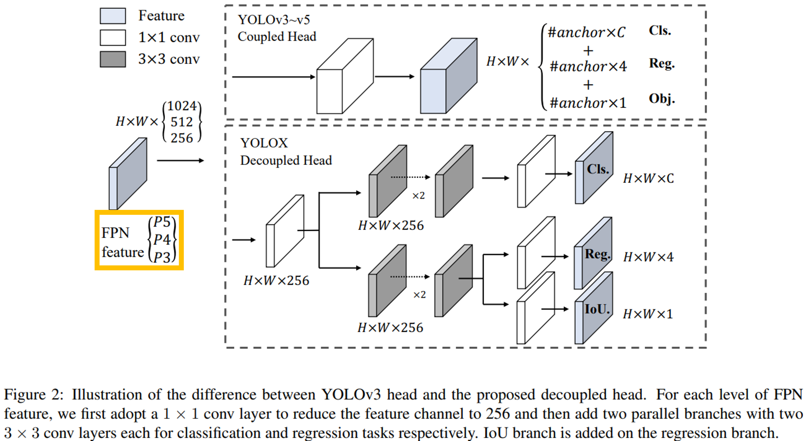

# YOLOX-Backbone

`yolox-backbone` is a deep-learning library and collection of [YOLOX](https://github.com/Megvii-BaseDetection/YOLOX) backbone models.

## Install

```
pip install yolox-backbone
```


## Load a Pretrained Model

Pretrained models can be loaded using yolox_backbone.create_model.

```python
import yolox_backbone

m = yolox_backbone.create_model('yolox-s', pretrained=True)
m.eval()
```

## Query the architecture information

After a feature backbone has been created, it can be queried to provide architecture information. The `.scaling_factor` attribute is a dictionary encapsulating the information about the scaling factor.

```python
import yolox_backbone

m = yolox_backbone.create_model('yolox-s', pretrained=True)
print('Network scaling factor: ', m.scaling_factor)
```

Output:

```python
Network scaling factor:  {'depth': 0.33, 'width': 0.5}
```

## Query the feature information

After a feature backbone has been created, it can be queried to provide channel information to the downstream heads without requiring static config or hardcoded constants. The `.out_channels` attribute is a dictionary encapsulating the information about the feature extraction points.

```python
import yolox_backbone

m = yolox_backbone.create_model('yolox-s', pretrained=True)
print('Feature channels: ', m.out_channels)
```

Output:

```python
Feature channels:  {'P3': 128, 'P4': 256, 'P5': 512}
```


## List Supported Models

```python
import yolox_backbone
from pprint import pprint

model_names = yolox_backbone.list_models()
pprint(model_names)
```

Output:

```python
['yolox-s',
 'yolox-m',
 'yolox-l',
 'yolox-x',
 'yolox-nano',
 'yolox-tiny',
 'yolox-darknet53']
```

## Select specific feature levels

There is one creation argument impacting the output features.

- `out_features` selects which FPN features to output



## Support for different number of input channels

You can create the model without the constraint that the number of input channel is 3.

But you have to set `pretrained` to `False`.
 
```python
import yolox_backbone

model = yolox_backbone.create_model(model_name=model_name, 
                                    pretrained=False, 
                                    input_tensor_channels=4,
                                    out_features=["P3", "P4", "P5"]
                                    )
```

## Example

```python
import yolox_backbone
import torch
from pprint import pprint

pprint(yolox_backbone.list_models())

model_names = yolox_backbone.list_models()
for model_name in model_names:
    print("model_name: ", model_name)
    model = yolox_backbone.create_model(model_name=model_name, 
                                        pretrained=True, 
                                        out_features=["P3", "P4", "P5"]
                                        )

    input_tensor = torch.randn((1, 3, 640, 640))
    fpn_output_tensors = model(input_tensor)

    p3 = fpn_output_tensors["P3"]
    p4 = fpn_output_tensors["P4"]
    p5 = fpn_output_tensors["P5"]
    
    print("input_tensor.shape: ", input_tensor.shape)
    print("p3.shape: ", p3.shape)
    print("p4.shape: ", p4.shape)
    print("p5.shape: ", p5.shape)
    print("-" * 50)
    
```

Output:
```python
['yolox-s', 'yolox-m', 'yolox-l', 'yolox-x', 'yolox-nano', 'yolox-tiny', 'yolox-darknet53']
model_name:  yolox-s
input_tensor.shape:  torch.Size([1, 3, 640, 640])
p3.shape:  torch.Size([1, 128, 80, 80])
p4.shape:  torch.Size([1, 256, 40, 40])
p5.shape:  torch.Size([1, 512, 20, 20])
--------------------------------------------------
model_name:  yolox-m
input_tensor.shape:  torch.Size([1, 3, 640, 640])
p3.shape:  torch.Size([1, 192, 80, 80])
p4.shape:  torch.Size([1, 384, 40, 40])
p5.shape:  torch.Size([1, 768, 20, 20])
--------------------------------------------------
model_name:  yolox-l
input_tensor.shape:  torch.Size([1, 3, 640, 640])
p3.shape:  torch.Size([1, 256, 80, 80])
p4.shape:  torch.Size([1, 512, 40, 40])
p5.shape:  torch.Size([1, 1024, 20, 20])
--------------------------------------------------
model_name:  yolox-x
input_tensor.shape:  torch.Size([1, 3, 640, 640])
p3.shape:  torch.Size([1, 320, 80, 80])
p4.shape:  torch.Size([1, 640, 40, 40])
p5.shape:  torch.Size([1, 1280, 20, 20])
--------------------------------------------------
model_name:  yolox-nano
input_tensor.shape:  torch.Size([1, 3, 640, 640])
p3.shape:  torch.Size([1, 64, 80, 80])
p4.shape:  torch.Size([1, 128, 40, 40])
p5.shape:  torch.Size([1, 256, 20, 20])
--------------------------------------------------
model_name:  yolox-tiny
input_tensor.shape:  torch.Size([1, 3, 640, 640])
p3.shape:  torch.Size([1, 96, 80, 80])
p4.shape:  torch.Size([1, 192, 40, 40])
p5.shape:  torch.Size([1, 384, 20, 20])
--------------------------------------------------
model_name:  yolox-darknet53
input_tensor.shape:  torch.Size([1, 3, 640, 640])
p3.shape:  torch.Size([1, 128, 80, 80])
p4.shape:  torch.Size([1, 256, 40, 40])
p5.shape:  torch.Size([1, 512, 20, 20])
--------------------------------------------------
```

# Acknowledgement

The docs are heavily based on [timm docs](https://rwightman.github.io/pytorch-image-models/). Thanks for their awesome works.
